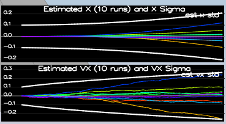

# Project Writeup #

## Sensor Noise ##

The standard deviation of the the GPS X signal is approximately 0.72 and the IMU Accelerometer X signal is approximately 0.50.
These values were calculated from the log files generated: `Graph1.txt` and `Graph2.txt`

By plugging these values in `config/6_Sensornoise.txt`, the tests from the scenario `06_SensorNoise` passed:
```
Simulation #301 (../config/06_SensorNoise.txt)
PASS: ABS(Quad.GPS.X-Quad.Pos.X) was less than MeasuredStdDev_GPSPosXY for 72% of the time
PASS: ABS(Quad.IMU.AX-0.000000) was less than MeasuredStdDev_AccelXY for 68% of the time
```

## Attitude Estimation ##

To reduce the errors in the estimated attitude (Euler Angles), I implemented a better rate gyro attitude integration scheme in `UpdateFromIMU()`:
```
Quaternion<float> attitude = Quaternion<float>::FromEuler123_RPY(rollEst, pitchEst, ekfState(6));
attitude.IntegrateBodyRate(gyro, dtIMU);

float predictedRoll = attitude.Roll();
float predictedPitch = attitude.Pitch();
ekfState(6) = attitude.Yaw();

// normalize yaw to -pi .. pi
if (ekfState(6) > F_PI) ekfState(6) -= 2.f*F_PI;
if (ekfState(6) < -F_PI) ekfState(6) += 2.f*F_PI;
```

The tests from the scenario `07_AttitudeEstimation` passed:
```
Simulation #303 (../config/07_AttitudeEstimation.txt)
PASS: ABS(Quad.Est.E.MaxEuler) was less than 0.100000 for at least 3.000000 seconds
```

## Prediction Step ##

I calculated the partial derivative of the body-to-global rotation matrix in the function `GetRbgPrime()`:
```
RbgPrime(0,0) = -cos(pitch)*sin(yaw);
RbgPrime(0,1) = -sin(roll)*sin(pitch)*sin(yaw) - cos(pitch)*cos(yaw);
RbgPrime(0,2) = -cos(roll)*sin(pitch)*sin(yaw) + sin(roll)*cos(yaw);
RbgPrime(1,0) = cos(pitch)*cos(yaw);
RbgPrime(1,1) = sin(roll)*sin(pitch)*cos(yaw) - cos(roll)*sin(yaw);
RbgPrime(1,2) = cos(roll)*sin(pitch)*cos(yaw) + sin(roll)*sin(yaw);
```

I implemented the rest of the prediction step (predict the state covariance forward) in `Predict()`:
```
gPrime(0, 3) = dt;
gPrime(1, 4) = dt;
gPrime(2, 5) = dt;
gPrime(3, 6) = RbgPrime * accel[0] * dt;
gPrime(4, 6) = RbgPrime * accel[1] * dt;
gPrime(5, 6) = RbgPrime * accel[2] * dt;

ekfCov  = gPrime * ekfCov * gPrime.transpose() + Q;
```

I tuned the `QPosXYStd` and the `QVelXYStd` process parameters in `QuadEstimatorEKF.txt` to
```
QPosXYStd =  0.05
QVelXYStd = 0.25
```

Looking at the plots, we can see that our covariance (the white line) grows very much like the data:


## Magnetometer Update ##

I tuned the parameter `QYawStd` to 0.20 so that it approximately captures the magnitude of the drift

I implemented the magnetometer update in the function `UpdateFromMag()`:
```
float yaw_diff = z(0) - ekfState(6);
if(yaw_diff > F_PI){
    z(0) -= 2.f*F_PI;
}
if(yaw_diff < -F_PI){
    z(0) += 2.f*F_PI;
}

zFromX(0)=ekfState(6);
hPrime(0,6)= 1;
```

The estimated standard deviation accurately captures the error and maintains an error of less than 0.1rad in heading for at least 10 seconds of the simulation:
```
Simulation #307 (../config/10_MagUpdate.txt)
PASS: ABS(Quad.Est.E.Yaw) was less than 0.120000 for at least 10.000000 seconds
PASS: ABS(Quad.Est.E.Yaw-0.000000) was less than Quad.Est.S.Yaw for 77% of the time
```

## GPS Update ##

Implement the EKF GPS Update in the function `UpdateFromGPS()`:
```
for (int i=0; i<6; i++){
  hPrime(i,i) = 1;
  zFromX(i) = ekfState(i);
}
```

The drone completed the entire simulation cycle with estimated position error of < 1m:
```
Simulation #309 (../config/11_GPSUpdate.txt)
PASS: ABS(Quad.Est.E.Pos) was less than 1.000000 for at least 20.000000 seconds
```

## Adding Your Controller ##

I didn't have to de-tune my controller to successfully fly the final desired box trajectory with my estimator and realistic sensors. Here are the final control params:
```
# Position control gains
kpPosXY = 40 
kpPosZ = 20
KiPosZ = 30

# Velocity control gains
kpVelXY = 15
kpVelZ = 9

# Angle control gains
kpBank = 10
kpYaw = 2

# Angle rate gains
kpPQR = 70, 70, -3
```